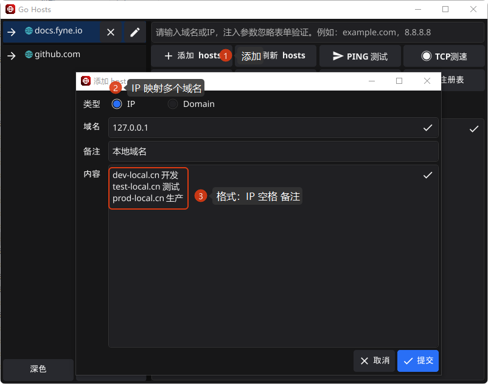
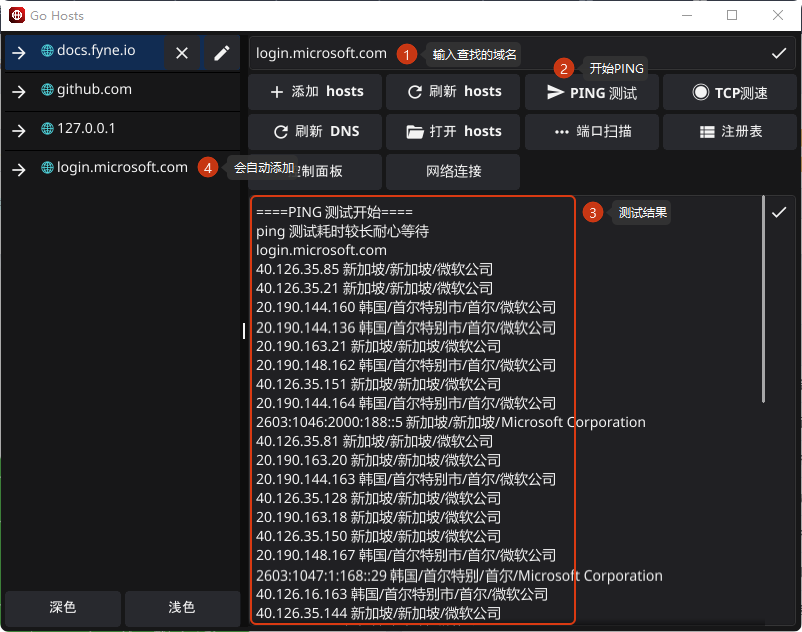

# Go Hosts 

首先向 SwitchHosts 致敬，是一个很好用的软件，这个软件和它一样都是用来管理 hosts 文件的。支持 **Windows** 和 **macOS**（Intel）。

Go Hosts 使用 go + [fyne](https://fyne.io/) 开发等技术开发，优点体积小，支持跨平台编译打包。

## 为什么会重复造轮子呢？

SwitchHosts 太大了（Electron），不太灵活。我对小工具的执念挺大，小工具就应该足够小（虽然还是不够小😊）。

1. PING 测试，快速找到目标网站**所有IP地址**，例如 github.com。
2. TCP 测试，快速找到当前网络环境连接最快的那个IP，配置 hosts 加速访问。
3. 支持扩展 cmd 命令菜单，把系统一些常用工具給串起来
4. 我就是玩！哈哈哈~

## 屏幕截图





## 功能

### 基础功能

* 图形化管理 hosts 规则（增、删、改、刷新）
* 支持一个 IP 绑定多个域名
* 支持一个域名绑定多个 IP，并可快速切换
* 支持 Ping 测试、TCP 测试、主题切换、系统托盘

### 数据类型说明

* **IP 类型**：一个 IP 对应多个域名，可同时启用多个规则
* **Domain 类型**：一个域名对应多个 IP，同一时间只启用一个

## 进阶功能

### Ping 测试

* 通过域名获取当前网络下可访问的所有 IP
* 用于排查解析慢或访问不稳定的问题

### TCP 测速

* 对多个 IP 进行并发 TCP 测试
* 自动选出当前网络最快的 IP

## 自定义按钮（高级）

支持通过 YAML 配置自定义操作按钮，用于执行系统或第三方命令。

* 按钮可显示在界面或系统托盘
* 支持参数注入，参数注入使用 `%s`
* 命令中涉及路径要写反斜杠 "/"
* 本质是 cmd 扩展，适用于任何可命令行操作的软件
* 查看支持的 [fyne icon](https://docs.fyne.io/explore/icons/)

### 示例

#### Window config.yaml

```yaml
cus_buttons:
  - name: "刷新 DNS"
    icon: "ViewRefreshIcon"
    cmd: "ipconfig /flushdns"

  - name: "打开配置"
    cmd: "cmd /c start %USERPROFILE%/.GoHosts"

  - name: "打开 hosts 文件"
    cmd: "notepad C:/Windows/System32/drivers/etc/hosts"

  # 若需要输入框注入参数使用 %s 可以注入输入的参数
  - name: "端口扫描"
    cmd: "fscan -h %s"

  - name: "注册表"
    icon: "ListIcon"
    cmd: "cmd /c regedit"

  - name: "控制面板"
    cmd: "control"

  - name: "网络连接"
    cmd: "cmd /c ncpa.cpl"
```

## 开发 & 打包

> [!IMPORTANT]
> Mac 应该是有限支持，为了支持 `Mac 10.15.x`，`fyne@v2.5.3`+`go 1.20`。
> 软件数据目录 window： `%USERPROFILE%/.GoHosts`，mac: `~/.GoHosts`。


1. 安装 go 并配置环境变量
2. 安装 [tdm-gcc](https://jmeubank.github.io/tdm-gcc/download/)
3. 安装 fyne 
    ```shell
    go install fyne.io/fyne/v2/cmd/fyne@latest
    ```

执行以下命令打包：

```shell
go mod tidy
# 打包 Window
fyne package -os windows
# 打包 Mac 
fyne package -os darwin
```

## 注意事项

### MacOS 权限问题

> [!IMPORTANT]
> MacOS 需修改 hosts 权限否则无法写入

执行以下命令修改权限

```shell
sudo chown $(whoami) /etc/hosts
# 或
sudo chmod u+w /etc/hosts
```

### Cause: APIUnavailable: WGL: The driver does not appear to support OpenGL

[mesa3d 发布页面](https://github.com/pal1000/mesa-dist-win/releases) 下载 [mesa3d](https://github.com/pal1000/mesa-dist-win/releases/download/25.3.3/mesa3d-25.3.3-release-msvc.7z)


1. 解压 `mesa3d-25.3.3-release-msvc.7z`。
2. 运行 `perappdeploy.cmd` 后，全部按回车键。
3. 运行 `systemwidedeploy.cmd` 后，输入【1】然后按回车键。（在 `cmd` 执行，不要直接双击）

## License

[Apache-2.0](https://spdx.org/licenses/Apache-2.0.html)
